# Getting Started Developing on OpenShift (New)

- [Getting Started Developing on OpenShift (New)](#getting-started-developing-on-openshift-new)
  - [Container Orchestration Primer](#container-orchestration-primer)
  - [Logging in with the Web Console](#logging-in-with-the-web-console)
  - [Creating a Project](#creating-a-project)
  - [Deploying an Application from Source Code](#deploying-an-application-from-source-code)
  - [Scaling Your Application](#scaling-your-application)
  - [Configuring Health Checks](#configuring-health-checks)
    - [Add Health Checks](#add-health-checks)
  - [Logs and Observability](#logs-and-observability)
  - [Managing Configuration with ConfigMaps and Secrets](#managing-configuration-with-configmaps-and-secrets)
  - [Adding Persistent Storage](#adding-persistent-storage)
  - [Deploying with Helm from a Custom Repository](#deploying-with-helm-from-a-custom-repository)
  - [Deploying via GitOps with the Argo CD UI](#deploying-via-gitops-with-the-argo-cd-ui)
  - [What's Next?](#whats-next)


**Estimated Time:** 50-60 minutes

## Container Orchestration Primer

Container Orchestration is the next logical progression after you become comfortable working with containers on a single host. With a single container host, containerized applications can be managed quite similarly to traditional applications, while gaining incremental efficiencies. With orchestration, there is a significant paradigm shift - developers and administrators alike need to think differently, making all changes to applications through an API.  Some people question the "complexity" of orchestration, but the benefits far outweigh the work of learning it. Today, Kubernetes is the clear winner when it comes to container orchestration, and with it, you gain:

* Application Definitions - YAML and JSON files can be passed between developers or from developers to operators to run fully-functioning, multi-container applications
* Easy Application Instances - Run many versions of the same application in different namespaces
* Multi-Node Scheduling - controllers built into Kubernetes manage 10 or 10,000 container hosts with no extra complexity
* Powerful API - Developers, Cluster Admins, and Automation alike can define application state, tenancy, and with OpenShift 4, even cluster node states
* Operational Automation - The [Kubernetes Operator Framework](https://www.redhat.com/en/topics/containers/what-is-a-kubernetes-operator#operator-framework) can be thought of as a robot systems administrator deployed side by side with applications managing mundane and complex tasks for the application (backups, restores, etc)
* Higher Level Frameworks - Once you adopt Kubernetes orchestration, you gain access to an innovative ecosystem of tools like Istio, Knative, and the previously mentioned Operator Framework.

**OpenShift** is Red Hat's enterprise-ready Kubernetes container platform. It builds on top of standard Kubernetes to provide a more comprehensive and developer-friendly experience, including features for building, deploying, and managing containerized applications at scale.

---

> [!NOTE]
This workshop will guide you through the basics of getting started with OpenShift. We will cover creating projects, deploying applications from source code, managing configuration with ConfigMaps and Secrets, and finally, deploying applications using both Helm and a GitOps approach.

---

## Logging in with the Web Console

Your first task is to log into OpenShift from the web console.


Go back to your [workshop landing page](https://demo.redhat.com/workshop/c8wjq) (you may need to login again using the same email address as before) and paste the `console_url` into your browser.

Use the credentials `user` and `password` from the landing page to login.

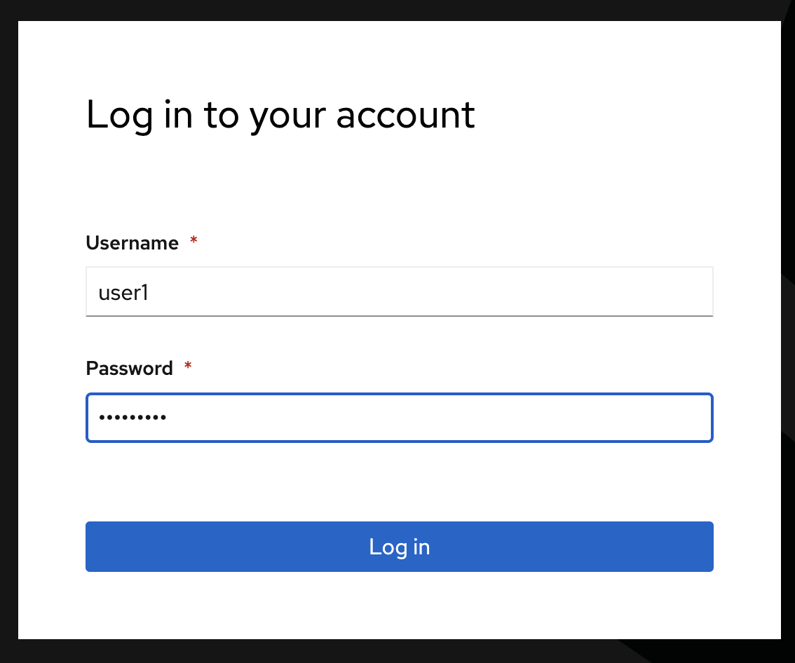

## Creating a Project

Now that we're logged in, let's create a **project** to house all of our applications and configurations so that we can be the admin of our space. In OpenShift, a **project** is a Kubernetes namespace with additional security and resource management features.

**Create a Project**

Once logged in, you will see your projects on screen. In the top right, click the blue button "Create Project".


Name your project `$USERNAME-project` an optional display name, and a description.

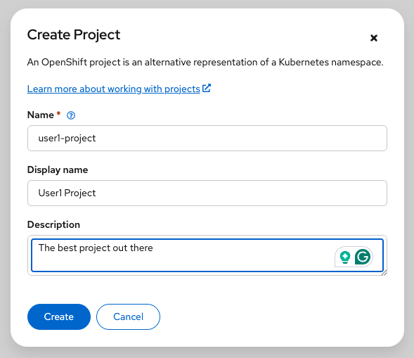

Click "Create". You will be automatically switched to your new project's dashboard.

## Deploying an Application from Source Code

OpenShift's Source-to-Image (S2I) capability allows you to build a runnable container image directly from your source code repository.

**Step 1: Add from Git**

  * At the top right of the screen, click the ⊕ symbol and choose "Import from Git"

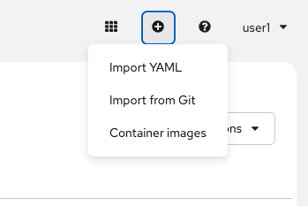

**Step 2: Configure the Deployment**

  * In the "Git Repo URL" field, enter the URL for a sample Node.js application: `https://github.com/sclorg/nodejs-ex.git`.
  * OpenShift will automatically detect the language and select the appropriate builder image.
  * Keep the default settings and ensure "Create a route to the application" is checked.
  * Click "Create".

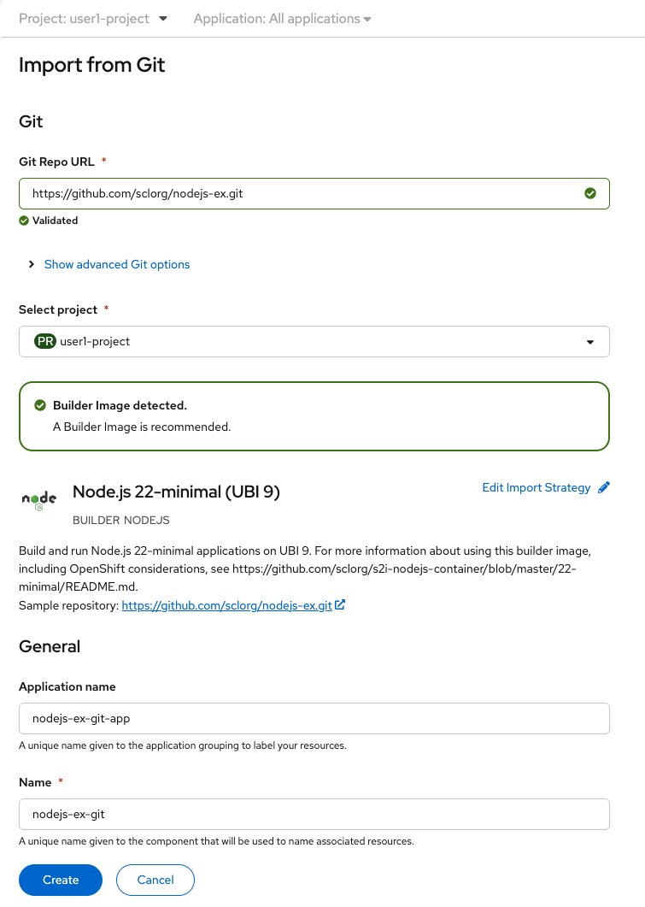

OpenShift will now build and deploy your application. You will be dropped off in the "Topology" view to monitor the progess.

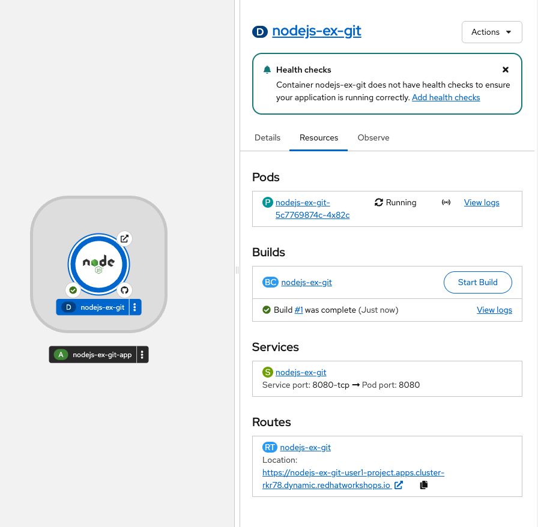

## Scaling Your Application

You can easily scale the number of running instances (pods) of your application.

  * In the "Topology" view, click on your application's deployment (the circle) if it is not already selected.
  * In the side panel, click the **Details** tab, and then click the up arrow next to the pod to increase the number of pods to 2. 

> [!NOTE]
> The word [**pod** is a Kubernetes term](https://kubernetes.io/docs/concepts/workloads/pods/). In this case, since our pod only contains one container, a **pod** refers to a single instance of the application.)

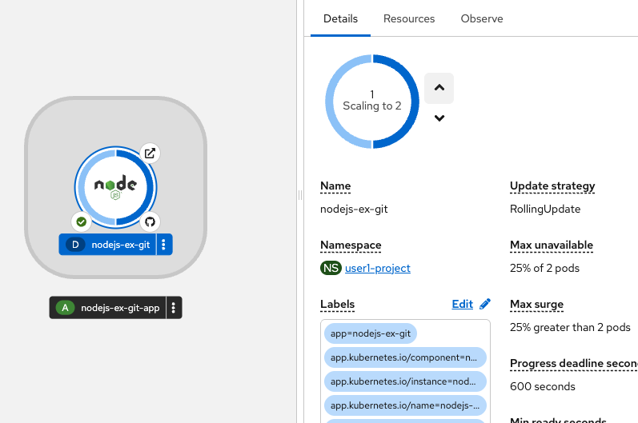

You now have two instances of the Node.js application running. But how does Kuberntes know which one to route traffic to?

> [!IMPORTANT]
> **Understanding Networking: Services and Routes**
When you deployed your application, OpenShift automatically created two key networking objects: a Service and a Route.
> **Service**: Think of a Service as a stable, internal address for your application's pods. Pods can be created or destroyed, but the Service provides a single, consistent endpoint for other applications inside the cluster to connect to. It acts as an internal load balancer.
> **Route**: A Route is what exposes your Service to the outside world. It gives your application a public, external URL so users can access it. It handles incoming traffic and directs it to the correct internal Service.

## Configuring Health Checks

Have you noticed the warning on the `nodejs-ex-git` Deployment about missing health checks? Health checks (probes) help OpenShift determine if your application is running correctly and ready to receive traffic.

  * **Startup Probe:** Checks if the application within a container has successfully started. It is particularly useful for applications that may take a long time to initialize.
  > [!NOTE]
  > When a startup probe is configured, all other probes (liveness and readiness) are disabled until the startup probe succeeds. This prevents them from interfering with a slow-starting application. 
  * **Liveness Probe:** Checks if the container is running and healthy. If it fails, OpenShift restarts the container. Use a liveness probe to handle situations where a process is running but in an unresponsive state. 
  * **Readiness Probe:** Checks if the application inside the container is ready to handle incoming network traffic requests. If it fails, OpenShift stops sending traffic to the pod by temporarily removing the pod's IP address from all matching service endpoints. This stops traffic from being routed to the pod, but does not kill the container. Once the probe passes again, the pod is added back to the service endpoints. 

### Add Health Checks

  * In the "Topology" view, click your deployment to open the details panel. Select the "Actions" dropdown and choose "Add Health Checks".
  


  * For our Node.js application, add both a Readiness and a Liveness probe with the following configuration:
      * **Type:** `HTTP GET`
      * **Path:** `/`
      * **Port:** `8080`
  * Click "Add". OpenShift will update the deployment and roll out a new version of your application with the probes enabled.
  


## Logs and Observability

Understanding how your application is behaving when live is critical to debugging and performance testing.

**Step 1: Viewing Application Logs**

  * In the "Topology" view, click on the pod ring to see the list of running pods.

  * Click on a pod name to open its details.

  * In the side panel, navigate to the "Logs" tab. Here you can see the real-time standard output from your application. You can pause, unpause, and download the logs.

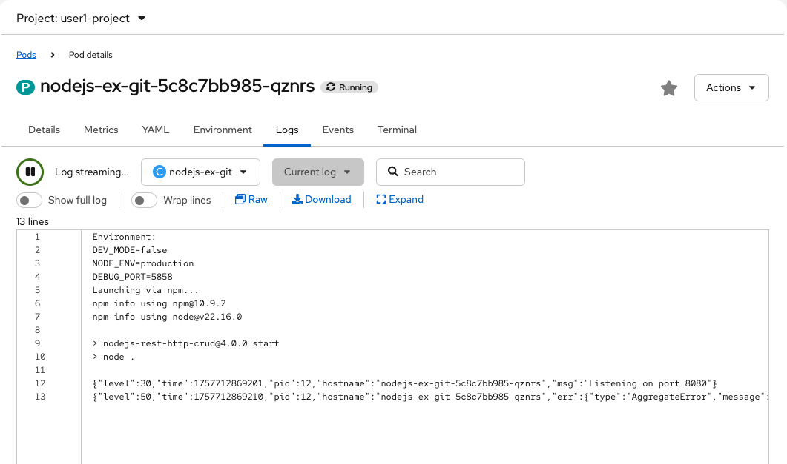

  * You can also view the Kubernetes events that have taken place to the pod resource by navigating to the "Events" tab


**Step 2: Viewing Basic Metrics**

  * Without the correct RBAC access right, you won't be able to view detailed metrics like the "Observe" page, but you can still see a subset of resource utilization metrics for your project.
  
  * In the left panel, navigate to "Home" → "Projects"

  * You will see graphs showing real-time CPU Usage, Memory Usage, and Network I/O for your project. Clicking on the usage number will show the largest consumers as well. This is a quick way to check your application's resource consumption.

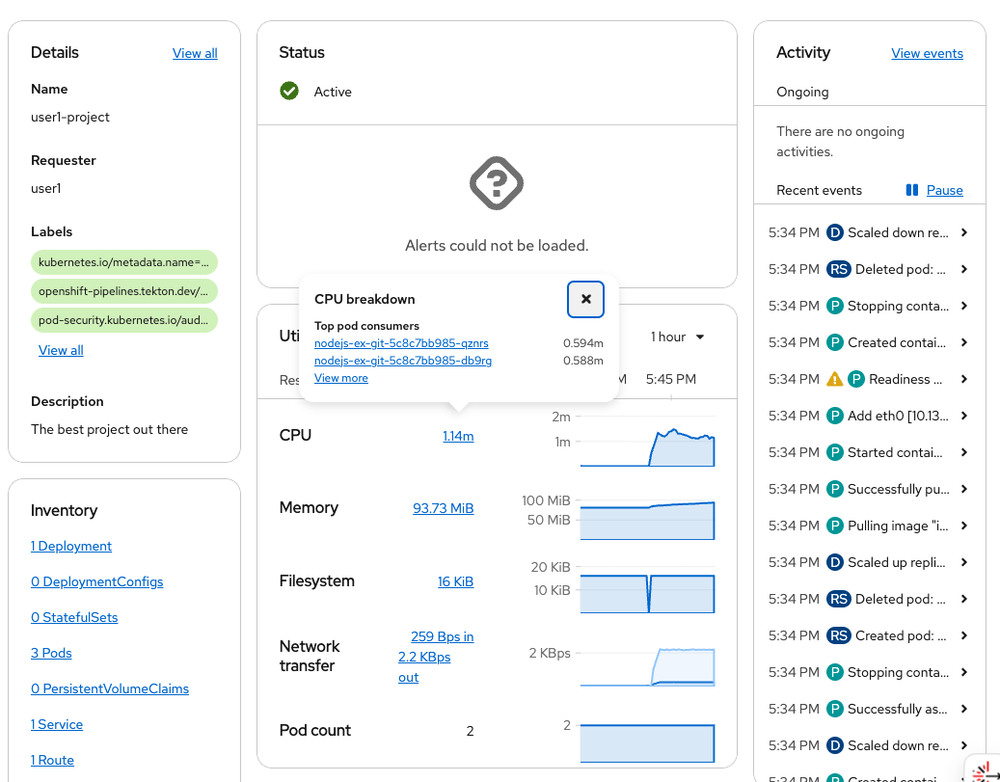

## Managing Configuration with ConfigMaps and Secrets

You should never hardcode configuration or sensitive data in your container images. OpenShift uses two primary resources for this:

  * **ConfigMaps:** For storing non-sensitive configuration data as key-value pairs (e.g., URLs, environment settings).
  * **Secrets:** For storing sensitive data like passwords, API keys, or certificates. The data is base64 encoded for transport but can be secured with more advanced cluster features or external secrets stores that can interact with kubernetes Secrets to securely access sensitive data on-demand.

**Step 1: Create a ConfigMap**

  * In the left panel, navigate to "Workloads" → "Configmaps". Ensure you are in the project you created earlier and choose "Create Configmap"

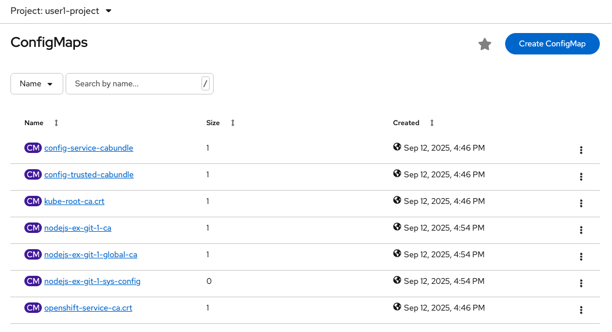

  * **Name**: `hello-app-config`
  * Under "Key/Value", add a key `GREETING_MSG` with the value `Hello from a ConfigMap!`
  * Click "Create".

**Step 2: Create a Secret**

  * Go back to the left panel, navigate to "Workloads" → "Secrets". Ensure you are in the project you created earlier and choose "Create key/value secret"

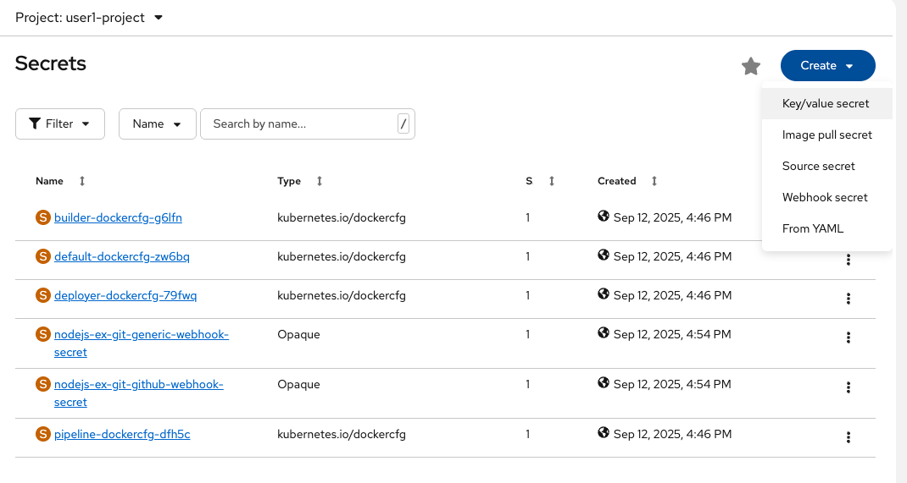

  * **Secret Name:** `secret-creds`
  * Under "Key/Value", add a key `API_KEY` with the value `ABC123`.
  * Click "Create".

**Step 3: Attach to the Application**

  * Go to "Workloads" → "Deployments" and click your `nodejs-ex-git` deployment.
  * Go to the "Environment" tab.
  * Click "Add all from ConfigMap or Secret", select `hello-app-config`
  * Repeat the process, this time selecting `secret-creds`
  * Click "Save"
  * A new deployment will roll out with `GREETING_MSG` and `API_KEY` injected as environment variables.


**Step 4: Verify the Changes**

  * After waiting a few seconds for the pods to redeploy, go to the "Pods" tab and choose one of the nodejs-ex-git pods.

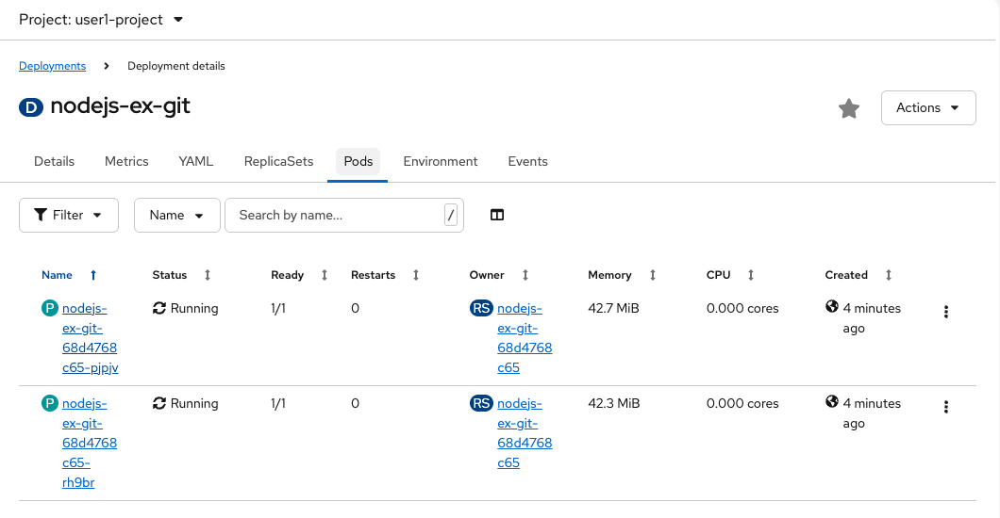

  * Go to the "Terminal" tab.
  * Inside the pod's terminal, use the `env` command to see the environment variables. You can filter the output to find your new variables:
    ```bash
    env | grep -E 'GREETING_MSG|API_KEY'
    ```
  * You should see the values you defined in your ConfigMap and Secret injected into the pod!

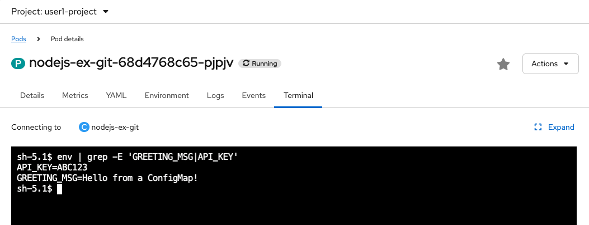

## Adding Persistent Storage

For data that needs to survive pod restarts, we need persistent storage.

> [!NOTE]
> Storage is a complicated topic well beyond the scope of this workshop, but when configured ahead of time, like in this workshop, storage is easy for application developers to use.

**Step 1: Create a Persistent Volume Claim (PVC)**

  * From left panel, select "Storage" > "PersistentVolumeClaims"
  * Click "Create PersistentVolumeClaim"


  * Configure the claim:
      * **StorageClass:** Choose the default
      * **PersistentVolumeClaim Name:** `my-app-storage`
      * **Access Mode:** Select `Single User (RWO)`
      * **Size:** `1` GiB
      * **Volume mode:** Filesystem
  * Click "Create".

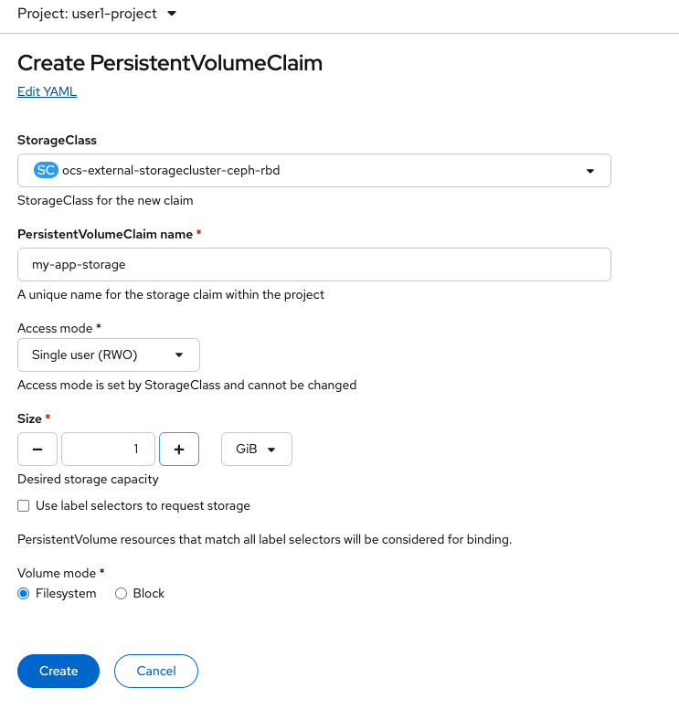

**Step 2: Attach and Mount the PVC**

  * Go back to and select the `nodejs-ex-git` deployment in the "Topology" view.
  * Select "Actions" \> "Add Storage".


  * Navigate to the "Volumes" tab.
  * Click "Add Volume" \> "PersistentVolumeClaim" and select the `app-storage` PVC you just created.
  * Under "Volume Mounts", click "Add Volume Mount", select the volume you just added, and set the **Mount Path** to `/opt/app-root/src/storage`.
  * Click "Save". The new pods will have this storage attached.
  * You can view your newly attached storage by going to a pod Terminal tab and running `df -h`

   

## Deploying with Helm from a Custom Repository

Helm charts are an easy way to deploy packaged applications. You may have a custom Helm repository at your company that you want to leverage with OpenShift.

**Step 1: Link the Custom Helm Repository**

  * From the left panel, select "Helm" > "Repositories". Then select "Create Helm Repository"
  * Configure the Helm Chart Repository
    * **Name:** `custom-helm-repo`
    * **Display name:** `Custom Helm Repository`
    * **URL:** `https://ultrajeff.github.io/helm-charts/`

    

  * Click "Create".

**Step 2: Pull Charts**

  * Go to "Home" > "Software Catalog" and select the "Helm Charts" type

    

  * Select "Custom Helm Repository" and select the Simple Vue App chart
  
    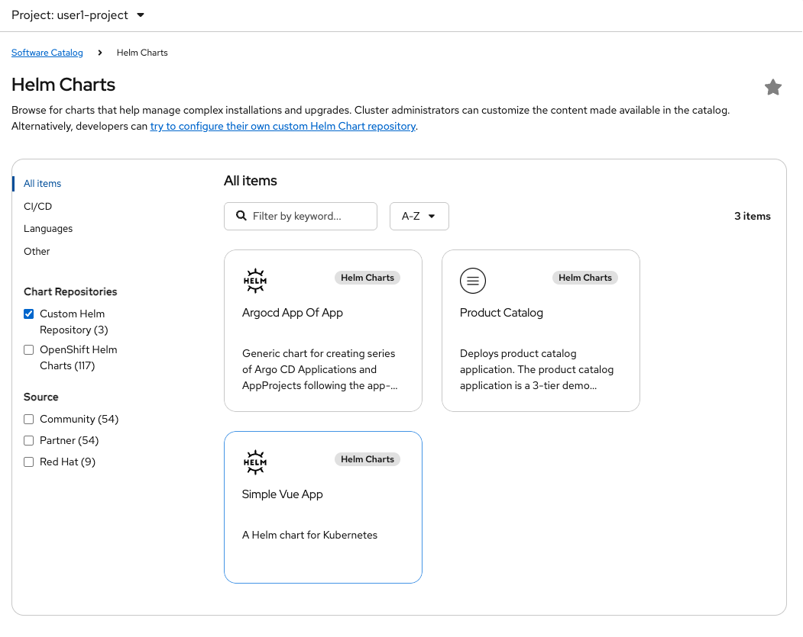

  * Hit "Create" on the pop-up
  * You can accept the default configuration for this workshop.
  * Click "Create". You will be taken to the "Topology" view, where you'll see the new Simple Vue App component being deployed.

> [!NOTE]
>  If you get an "Application is Unavailable" notice when visiting the app Route, this is because your browser is forcing an HTTPS redirect but the Route is not set up for that. In order to fix this issue, you will need to modify the Route YAML to redirect insecure edge requests. Can you figure out how?

<!-- Proctor note: Make sure to add all workshop users to the default AppProject with access rights to create Applications ahead of time -->

## Deploying via GitOps with the Argo CD UI

GitOps is a pattern that uses a Git repository as the single source of truth for your deployment. It is considered a continuous delivery pattern and is the modern CD in CI/CD. Tools like OpenShift GitOps/ArgoCD are able to auto-reconcile what is in Git with what is live to ensure parity or to alert you to any changes that might have occurred, like direct edits to live objects.

**Step 2: Access the Argo CD Dashboard**

  * Use the application launcher (the grid icon in the top bar) and click on "Cluster Argo CD".
  * Use the "Log in via OpenShift" button and enter in your workshop username and password. Then accept the access request.

**Step 3: Create a New Application in Argo CD**

  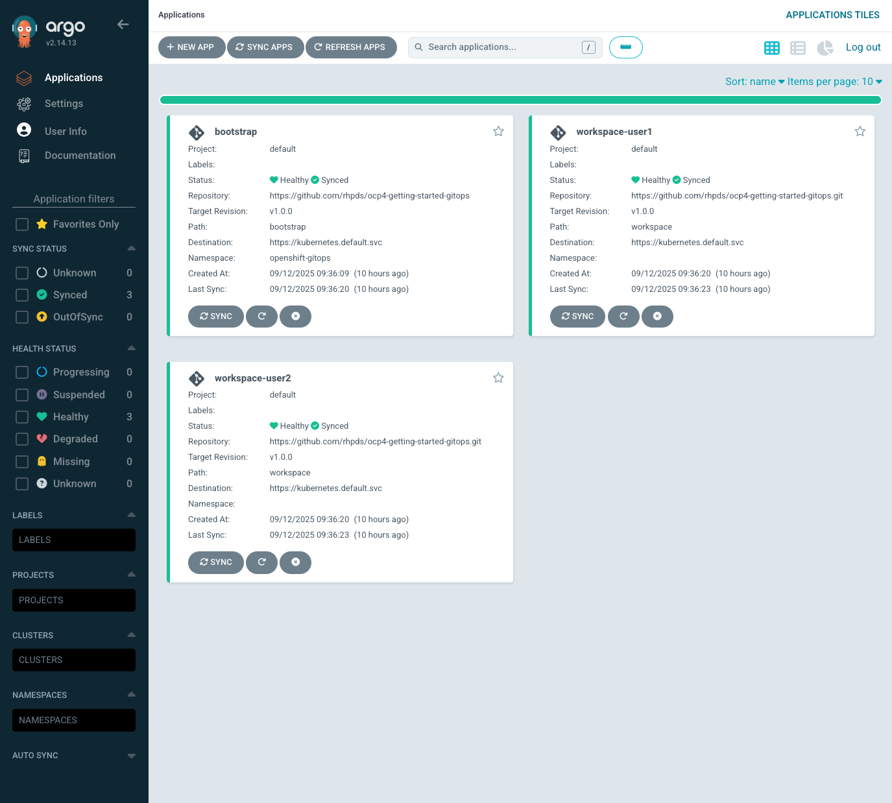

  * In the Argo CD UI, click the "+ New App" button.
  * Fill out the form with the following details:
      * **Application Name:** `todo-demo-app`
      * **Project:** `default`
      * **Sync Policy:** `Automated` (also check `Prune Resources` and `Self Heal`).
      * **Repository URL:** `https://github.com/tosin2013/todo-demo-app-helmrepo`
      * **Revision:** `main`
      * **Path:** `charts/todo-demo-app`
      * **Cluster URL:** `https://kubernetes.default.svc`
      * **Namespace:** Put the name of the Project you have been using this whole time e.g. `userX-project`
  * Click "Create" at the top of the page.

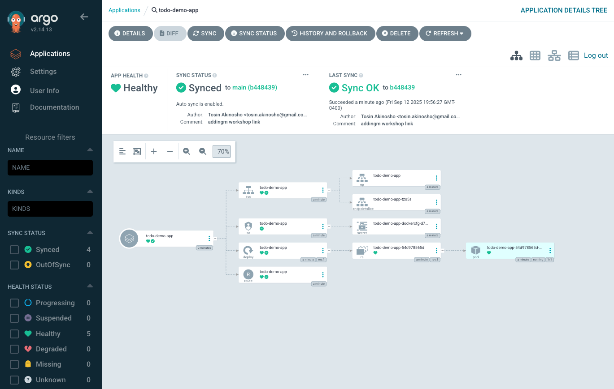

Argo CD will now automatically sync the manifests from your Git repository into the `userX-project` project. Switch back to the "Developer" perspective in OpenShift to see the guestbook application appear in the topology.

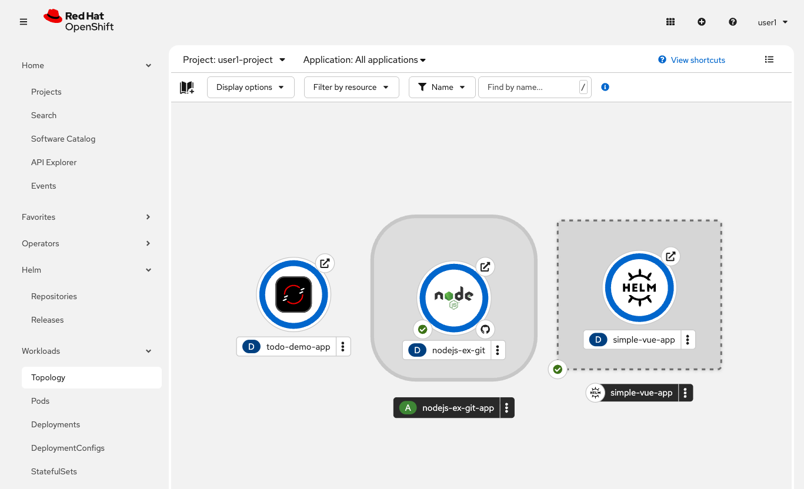

<!-- TODO - Work on permissions issue "system:anonymous"-->
<!-- ## Automating Builds with Webhooks (Optional)

*(This section uses the CLI and your Git provider's UI)*

For a real workflow, you want the build and deployment to happen automatically when you push new code.

**Step 1: Find your BuildConfig and Webhook URL**

  * In the left navigation pane, go to the "Builds" section. **Builds** and **BuildConfigs** provide a high-level encapsulation of what is needed to build your application on OpenShift, including source repository, output location, pull secret references.
  * Click on the `nodejs-ex-git` BuildConfig.
  * In the "Details" tab, scroll down to the "Webhooks" section.
  * Click the "Copy URL" button next to the **GitHub** webhook.

**Step 2: Configure the Webhook in GitHub**

  * Fork the `https://github.com/sclorg/nodejs-ex` repository on GitHub.
  * Navigate to your forked version of the `nodejs-ex-git` repository in GitHub.
  * Go to "Settings" \> "Webhooks".
  * Click "Add webhook".
  * Paste the URL you copied from OpenShift into the "Payload URL" field.
  * Change the "Content type" to `application/json`.
  * Click "Add webhook".

**Step 3: Test the Automation**

  * Clone the Git repository to your local machine, make a small change to the `views/index.html` file, and then commit and push your change.
    ```bash
    git commit -am "Testing webhook trigger"
    git push
    ```
  * Switch back to the OpenShift console and watch in the "Builds" section as a new build automatically kicks off, followed by a new deployment. -->

---

## What's Next?

Congratulations on completing the OpenShift workshop!

You've gone through the entire "outer loop" application lifecycle, from deploying your first application from source code to scaling it, managing its configuration, adding persistent storage, and even automating its lifecycle with webhooks and a full GitOps workflow. You now have a solid, hands-on foundation for building and managing modern, cloud-native applications on OpenShift.Keep using this project as a sandbox to continue exploring while it exists. What can you build on OpenShift?

Keep learning about OpenShift:

* Visit the [Red Hat Developer learning page](https://developers.redhat.com/learn) for more labs and resources
* [Want to try a free, instant 30-day OpenShift cluster? Get started with the Developer Sandbox for Red Hat OpenShift](https://developers.redhat.com/developer-sandbox)