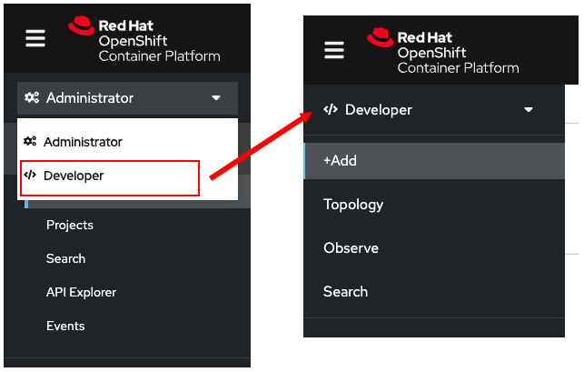
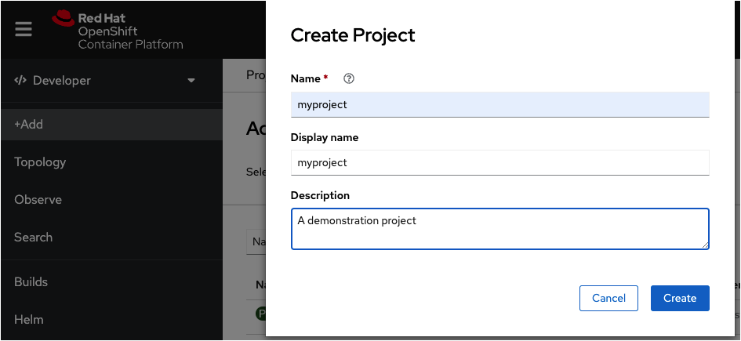
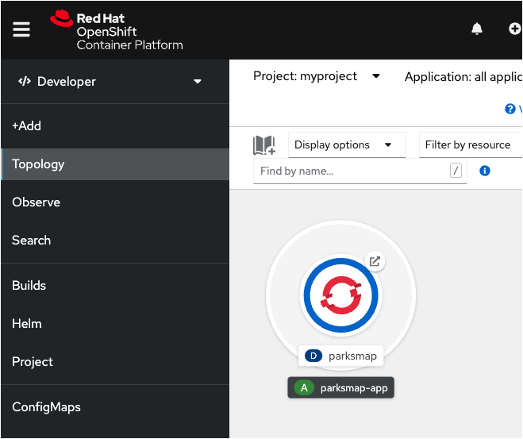
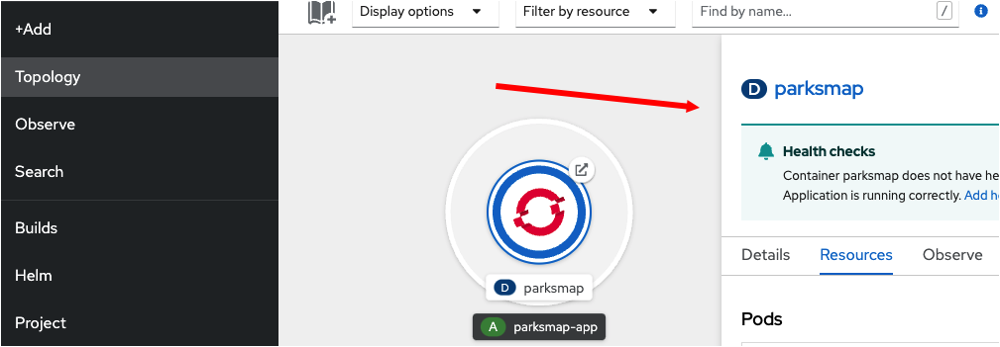
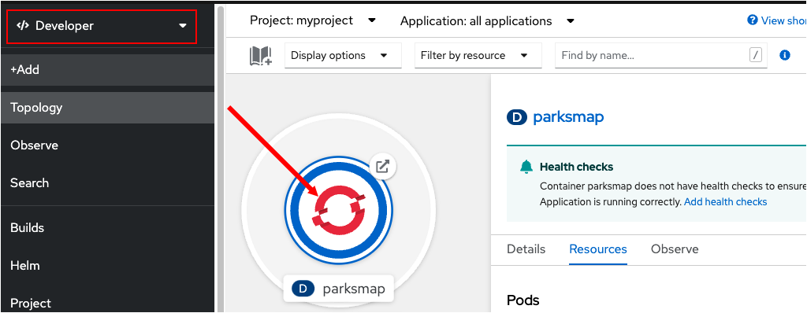

# Getting Started Developing on OpenShift

- [Getting Started Developing on OpenShift](#getting-started-developing-on-openshift)
  - [Deploying with an Image](#deploying-with-an-image)
    - [Working with the Command Line Interface (CLI)](#working-with-the-command-line-interface-cli)
    - [Logging in with the CLI](#logging-in-with-the-cli)
    - [Congratulations!](#congratulations)
    - [Logging in with the web console](#logging-in-with-the-web-console)
    - [Understanding projects in OpenShift](#understanding-projects-in-openshift)
    - [Creating a project](#creating-a-project)
    - [Congratulations!](#congratulations-1)
    - [Scaling up the application](#scaling-up-the-application)
    - [Verifying the number of replicas](#verifying-the-number-of-replicas)
    - [Understanding application "self healing"](#understanding-application-self-healing)
    - [Scaling down an application](#scaling-down-an-application)
    - [Congratulations!](#congratulations-2)
    - [Viewing a route's URL](#viewing-a-routes-url)
    - [Accessing a Route's URL](#accessing-a-routes-url)
    - [Congratulations!](#congratulations-3)
  - [Deploying with a Helm Chart](#deploying-with-a-helm-chart)
    - [Helm Command Line Interface (CLI)](#helm-command-line-interface-cli)
    - [Creating a New Project](#creating-a-new-project)
    - [Exercise: Explore CLI](#exercise-explore-cli)
    - [Deploy a Helm Chart](#deploy-a-helm-chart)
    - [Verify the deployment from OpenShift Console](#verify-the-deployment-from-openshift-console)
    - [Uninstall and clean](#uninstall-and-clean)
  - [Create Your First Helm Chart](#create-your-first-helm-chart)
  - [Creating a new Helm Chart](#creating-a-new-helm-chart)
  - [Managing Helm Revisions in OpenShift](#managing-helm-revisions-in-openshift)
    - [Upgrade revisions](#upgrade-revisions)
    - [Add OpenShift Route as Template](#add-openshift-route-as-template)
    - [Upgrade and Rollback](#upgrade-and-rollback)
    - [Uninstall](#uninstall)
  - [What's Next?](#whats-next)


## Deploying with an Image

### Working with the Command Line Interface (CLI)

You can access the Red Hat OpenShift CLI with the command `oc`. Using the `oc` command lets you work with the entire OpenShift cluster and deploy new applications.

The CLI exposes the underlying Kubernetes orchestration system with the enhancements made by OpenShift. Users familiar with Kubernetes will be able to adapt to OpenShift quickly.

`oc` provides all of the functionality of the Kubernetes `kubectl` CLI tool. In addition, `oc` makes it easier to work with OpenShift. The CLI is ideal in situations where you are:

* Working directly with project source code
* Scripting OpenShift operations
* Cannot use the web console because of resource bandwidth restrictions

Let's start by logging in with `oc` for your first experience with this CLI.

### Logging in with the CLI
You log into OpenShift from the command line using the `oc login` command.

----

`Step 1:` Run the following command in the terminal window to the left:

```
oc login -u admin -p LAB_PASSWORD LAB_API_ENDPOINT --insecure-skip-tls-verify=true
```

Upon successful login, you'll get results similar to the following:

```
Login successful.

You have access to 86 projects, the list has been suppressed. You can list all projects with 'oc projects'

Using project "admin-devspaces".
```

Running the Linux [`whoami`](https://en.wikipedia.org/wiki/Whoami) command reports the current user and implicitly confirms that the login is successful.

----

`Step 2:` Run the following command:

```
oc whoami
```

You'll get the following results:

```
admin
```

### Congratulations!

 You've logged in to OpenShift using the `oc` command line tool.

----

This topic focuses on learning how to log into the Red Hat OpenShift web console and then create an application once logged in.

### Logging in with the web console

Your first task is to log into OpenShift from the web console.

----

`Step 1:`
Click the **Web Console** tab from the horizontal menu bar over the terminal to the left to open the OpenShift web console.

You will be presented with the OpenShift login screen. Use the following credentials to log in.
* **Username:** `admin`
* **Password:** `<LAB_PASSWORD>`

Log into the OpenShift web console, as shown in the figure below.


|NOTE:|
|----|
|You might see the following warning notification due to using an untrusted security certificate.

If you do get the warning, click the **Advanced** button to complete the process necessary to grant permission to the browser to access the OpenShift Web Console.|

After logging into the web console, take a look a the menu on the left. Notice that you're in the **Administrator** perspective, as shown in the figure below:


You need to change the perspective from **Administrator** to **Developer**.

----

`Step 2:` Select the **Developer** perspective from the dropdown on the left side menu in the OpenShift web console as shown in the figure below.



Now that you're in the **Developer** perspective, let's take a moment to discuss the concept of a **project** in OpenShift.

### Understanding projects in OpenShift

OpenShift is often referred to as a container application platform in that it's a platform designed for the development and deployment of applications in [Linux containers](https://developers.redhat.com/topics/containers).

OpenShift has an organizational unit named **project**. You use a **project** to group resources in your application. The reason for organizing your application in a **project** is to enable controlled access and quotas for developers or teams.

You can think of a **project** as a visualization of the Kubernetes namespace based on the developer access controls.

Now, let's create a project.

### Creating a project

In this section you will create a project using the OpenShift web console.

----

`Step 3:` Click the **Web Console** tab from the horizontal menu bar over the terminal to the left to open the OpenShift Web Console.

Click the button labeled **+Add** on the menu bar on the left side of the Web Console. The **Add** web page appears.

----

`Step 4:` Click the link with the text **Create a project** as shown in the figure below:


You'll be presented with the **Add Project** dialog for declaring the project.

----

`Step 5:` Name the project `myproject` as shown in the figure below:



----

`Step 6:` Then click the button labeled `Create` as shown in the figure above.

You will be presented with the **Add** page as shown in the figure below.


----

`Step 7:` Scroll down the page and click the text block labeled `Container images` as shown in the figure above.


You'll be presented with the **Deploy Image** page as shown in the figure below.


----

`Step 8:` Enter the text below in the text box labeled **Image name from external registry**

```
quay.io/openshiftroadshow/parksmap:1.3.0
```

Adding content to the text boxes in the rest of the form is optional.

----

`Step 9:` Scroll down the page and click the button labeled `Create` to continue.

After you create the application, you will be presented with the **Topology** view as shown in the figure below.

You will spend most of your time in the remainder of this tutorial in that perspective.



You are now ready to scale the application up and down.

### Congratulations!

 You deployed an application from a container image using the OpenShift web console.

----

In this step, you will learn how to scale your application up by creating multiple replicas of the pod that represents the application in the cluster. Red Hat OpenShift will make it look like all of the replicas are a single application. But, behind the scenes, OpenShift routes traffic among the replicas automatically.

The benefit of replicating a pod is that it increases the amount of Internet traffic the application can accommodate. The result is better overall performance.

### Scaling up the application

You will scale up the application up to 2 replicas.

----

`Step 1:` Click inside the circle for the `parksmap` application you just installed within the **Topology** view. The details window will appear in a side panel as shown in the figure below.



----

`Step 2:` In the side panel, click the **Details** tab, and then click the up arrow next to the pod to increase the number of pods to 2. (The word [`pod` is a Kubernetes term](https://kubernetes.io/docs/concepts/workloads/pods/). In this case, a `pod` refers to an instance of the application.)

The figure below illustrates selecting the **Details** and increasing the number of pods to 2.


You are now running two replicas of the application.

### Verifying the number of replicas

----

`Step 3:` To verify that we changed the number of replicas, click the **Resources** tab in the side panel. You will see a list of pods as shown in the figure below.


You can see that we now have 2 replicas. Now, let's take a look at OpenShift's self-healing feature. Self Healing ensures that the number of pods you declare for your application is always running.

### Understanding application "self healing"

Under the OpenShift application **Deployments** are constantly monitored to see that the desired number of pods are actually running. Therefore, if the actual state ever deviates from the desired state--for example, if a pod goes down--OpenShift will fix the situation.

Now you will kill one of the pods to see if OpenShift will bring it back to life.

----

`Step 4:` On the **Resources** tab where you viewed the list of pods after scaling to 2 replicas, click the name of one of the pods in the list as shown in the figure below.


----

`Step 5:` In the top right corner of the page, there is an **Actions** drop down menu. Click it and select **Delete Pod** as shown in the figure below.


After deleting the pod, you will be taken to a page listing pods. Notice that even though you deleted one pod, two pods are still running, as shown in the figure below.


A replacement pod was created because OpenShift will always make sure that when a pod dies, it creates a new pod to fill its place.

### Scaling down an application

Before we continue, go ahead and scale your application down to a single instance.

----

`Step 6a:` Click the **Topology** item on the left side menu.

`Step 6b:` Click the `parksmap` circle.

`Step 6c:` Click the **Details** tab in the side panel.

`Step 6d:` Click the down arrow to the right of the pod circle to reset the number of pods to 1 as shown in the figure below.


### Congratulations!

 You've learned how to use the OpenShift web console to scale the number of replica pods for an application up and down.

----

In this step you will explore **routes**.

In Red Hat OpenShift, the **service** resource provides the internal abstraction that binds access to an application to its logic, which is represented in an application's pods. Also, a **service** provides load-balancing capabilities within an OpenShift environment.

The binding of a **service** to an application's pods is internal to an OpenShift cluster. The way that external clients access applications running in OpenShift is through the OpenShift routing layer.

The formal name for the resource which represents the routing layer is called a **route**.

As mentioned earlier in the tutorial, When you create an application from a **container image**, OpenShift creates a **route** for the application automatically. Let's take a look at where the **route** is published. Then, let's access the application's website from a browser using its route URL.

### Viewing a route's URL


`Step 1:` To view the **route** for your application, make sure you are in the **Developer** perspective by selecting **Developer** from the dropdown list on the left side menu bar. Then from within **Topology** view, click the application circle as shown in the figure below.



The information page for the pods will slide out as a panel on the right-hand side of the page.

----

`Step 2:` Click the **Resource** tab in the side panel.

----

`Step 3:` Scroll down to the **Routes** section at the bottom of the web page as shown figure below.


The route URL for your application is shown as a link.

----

`Step 4:` Click that link to load the application's web page in your browser.

### Accessing a Route's URL

You can also access an application's **route** URL directly within the application's circular graphic in the **Topology** page.

----

`Step 5:` Click the icon in the upper right of the application's circular graphic as shown in the figure below.


Clicking the icon opens the application's web page in a browser as shown in th figure below.


----

### Congratulations!

 You have now located the application's **route** URL in the OpenShift web console. Also, you've learned how to open the application in a web page from the **Resource** tab in the application detail, and also directly from the application's circular graphic in the **Topology** view.

This is the final step in this track.

## Deploying with a Helm Chart

At the end of this section you will be able to:
- Use `helm` CLI
- Install `helm repository`
- Search, install and uninstall `Helm Charts`
- Review Helm Charts from `OpenShift Console`

### Helm Command Line Interface (CLI)

In this scenario you will find the Helm CLI already installed for you, which can be  also retrieved from OpenShift Console, top right corner, click on ? -> Command Line Tools.

The CLI is the entry point for any interaction with Helm 3 subsystem. In addition to that, OpenShift Developer Catalog, which is the central hub for all developer content, has support for Helm Charts in addition to Operator-backed services, Templates, etc.

When a user instructs the Helm CLI to install a Helm Chart, the information about the Helm Chart is fetched from the repository, rendered on the client and then applied to Kubernetes while a record of this installation is created within the namespace (which is known as a Release).


### Creating a New Project

Let's create a new OpenShift Project to have a namespace for our helm charts to work with.

```
oc new-project helm
```

### Exercise: Explore CLI
Let's get started by using `helm` getting CLI version :

```
helm version
```

This should confirm we are using **Helm 3**.

As discussed in the previous step, Helm Charts are available through repositories, and those can be pre-installed or installable by the user.

You can search for Helm Charts available in any public repositories through [Helm Hub](https://hub.helm.sh/).

For instance, searching Helm Charts for [NGINX](https://nginx.com):

```
helm search hub nginx
```

This will give a list of available charts from multiple repositories. If we want to install it, we need to have such repositories configured.

By default the list of available repositories is empty. You can add a new one with the CLI. For NGINX, add Bitnami repository:

```
helm repo add bitnami https://charts.bitnami.com/bitnami
```

Once added, verify it is present:

```
helm repo list
```

You can search for Helm Charts also inside repos, like in the one you just installed:

```
helm search repo bitnami/nginx
```

### Deploy a Helm Chart

You can use `helm install` command to deploy your charts and start managing revisions.

To install [NGINX Chart](https://hub.helm.sh/charts/bitnami/nginx):

```
helm install my-nginx bitnami/nginx --set service.type=ClusterIP
```

This will install `nginx`, and for this example, we want to use `ClusterIP` Service type because we want to expose it afterwards through an OpenShift `Route`.

Check your Helm releases:

```
helm ls
```

Verify all the pods are in Running state and Ready:

```
oc get pods
```

Now expose `my-nginx` service to access it via OpenShift `Route`:

```
oc expose svc/my-nginx
```

Verify that route has been created:

```
oc get routes
```

You can click on the generated host to access the NGINX Pod provided by your just installed Helm Chart, or you can do it from OpenShift Console.

### Verify the deployment from OpenShift Console

To verify the creation of the resources generated by the Helm Chart, you can head out to the OpenShift web console.

Make sure the Developer perspective from the dropdown in the top left corner of the web console is selected as shown below:


Next, select the Project dropdown menu shown below and choose `helm` project you have been working with.

Next, click on the Topology tab on the left side of the web console if you don't see what's in the image below. Once in the Topology view, you can see the Deployment for `my-nginx` application and you can access it by clicking on the URL generated by the OpenShift Route:


You'll notice the HR label and Helm icon below, this means that this application is managed by Helm, and you can overview Helm `Releases` for this app from left side menu, Helm section:


Explore all `Resources` that are associated with a particular Helm `Release`, click on `my-nginx` Helm Release and then click on `Resouces` tab:


### Uninstall and clean

Come back to Terminal clicking on Terminal tab.

Uninstall `my-nginx` release:

```
helm uninstall my-nginx
```

Delete previously created `route`:

```
oc delete route my-nginx
```

## Create Your First Helm Chart

At the end of this section you will be able to:
- Create your own `Helm Chart`
- Understand `Helm Templates`
- Understand Helm integrations with `Kubernetes`


After having discovered `helm` CLI to install and manage Helm Charts, we can now create our first one from scratch. Before doing that, let's review the core concepts from [official documentation](https://helm.sh/docs/topics/charts/):

- A `Chart` is a Helm package. It contains all of the resource definitions necessary to run an application, tool, or service inside of a Kubernetes cluster.
- A `Repository` is the place where charts can be collected and shared.
- A `Release` is an instance of a chart running in a Kubernetes cluster-


Helm uses a packaging format called charts. A chart is a collection of files that describe a related set of Kubernetes resources, and it organized as a collection of files inside of a directory. The directory name is the name of the chart.

## Creating a new Helm Chart

Navigate to `/root` directory:

```
cd /root
```

With `helm create` command you can create a chart directory along with the common files and directories used in a chart.

An Helm chart called `my-chart` has been already generated with the following command:

`helm create my-chart`


Inside `my-chart/` folder you will find the following files, you can also review them from the **Visual Editor** Tab.

```
cd my-chart
ls -la
```

* `Chart.yaml`: is a YAML file containing multiple fields describing the chart
* `values.yaml`:: is a YAML file containing default values for a chart, those may be overridden by users during helm install or helm upgrade.
* `templates/NOTES.txt`: text to be displayed to your users when they run helm install.
* `templates/deployment.yaml`: a basic manifest for creating a Kubernetes deployment
* `templates/service.yaml`: a basic manifest for creating a service endpoint for your deployment
* `templates/_helpers.tpl`: a place to put template helpers that you can re-use throughout the chart

This command generates a skeleton of your Helm Chart, and by default there is an NGINX image as example:


**1. Chart description**

Let's review our `Chart.yaml`. This contains `version` of the package and `appVersion` that we are managing, typically this can be refered to a container image tag.

**2. Fill chart with custom values**

In our example, we are working on a Helm Template `templates/deployment.yaml` describing a Kubernetes Deployment for our app, containing this structure for `spec.containers.image`:

`image: "{{ .Values.image.repository }}:{{ .Values.image.tag }}"`

> **Note:** *By default `appVersion` from `Chart.yaml` is used as image tag*

In `values.yaml` add `image.repository` variable to define the container image for our chart.

From the **Visual Editor** Tab, open `values.yaml` file and add this line after the `# TODO: image repository` comment:

```yaml
repository: bitnami/nginx
```

Now let's define which tag to use for this container image.
Add this line after the `# TODO: image tag"` comment:

```yaml
tag: latest
```


**3. Install**

Install our custom Helm Chart from local folder.

```
cd /root
helm install my-chart ./my-chart
```

This will install NGINX like in previous chapter, and we can follow installation like in previous chapter, either from Terminal or OpenShift Console:

```
oc get pods
```


Review installed revision:

```
helm ls
```

In next chapter we will add an OpenShift Route as a Helm Template, like for `Service`, to be published in a new revision.

## Managing Helm Revisions in OpenShift

At the end of this section you will be able to:
- Manage multiple `Helm Revisions` for your Helm Chart
- `Upgrade` revisions for new changes
- Revert changes with `Rollback` of revisions

### Upgrade revisions

When we install a Helm Chart on OpenShift, we publish a release into the cluster that we can control in terms of upgrades and rollbacks.

To change something in any already published chart, we can use `helm upgrade` command with new parameters or code from our chart.

### Add OpenShift Route as Template

From the Visual Editor, create a new template for OpenShift Route in `templates` directory. From the `templates` directory, create a new file called `routes.yaml`. Copy the following content to that file:

```yaml
apiVersion: route.openshift.io/v1
kind: Route
metadata:
  name: {{ include "my-chart.fullname" . }}
  labels:
    {{- include "my-chart.labels" . | nindent 4 }}
spec:
  port:
    targetPort: http
  to:
    kind: Service
    name: {{ include "my-chart.fullname" . }}
    weight: 100
  wildcardPolicy: None
```

Run `helm upgrade` to publish a new revision containing a `my-charm` Route:

```
helm upgrade my-chart ./my-chart
```

Verify new `Route` from Terminal:

```
oc get routes
```

Verify new `Revision`:

```
helm ls
```

Verify new `Route` and new `Revision` from Console:


### Upgrade and Rollback

Let's update again our existing release overriding values in `values.yaml` changing `image.pullPolicy` from chart's default value `IfNotPresent` to `Always`, using same method we adopted previously for changing `service.type` with option `--set`:

```
helm upgrade my-chart ./my-chart --set image.pullPolicy=Always
```

Let's verify that our changes is reflected into resulting `Deployment`:

```
oc get deployment my-chart -o yaml | grep imagePullPolicy
```

Get current `Revision`:

```
helm ls
```

Now that our new release is published and verified, we can decide to rollback to previous version if we need to, and this is possible with `helm rollback` command.

It is also possible to dry-run the rollback with `--dry-run` option:

```
helm rollback my-chart 2 --dry-run
```

Rollback to starting revision:

```
helm rollback my-chart 2
```

Check pods:

```
oc get pods
```

Verify `imagePullPolicy` is rolled back to `Revision` 2 containing `IfNotPresent` Policy:

```
oc get deployment my-chart -o yaml | grep imagePullPolicy
```

### Uninstall

Uninstall will clean everything now, there's no further need to delete manually the `Route` like in first chapter, since the Helm Chart is now managing that resource:

```
helm uninstall my-chart
```

## What's Next?

Congratulations on completing this lab. Keep learning about OpenShift:

* Visit the [Red Hat Developer learning page](https://developers.redhat.com/learn) for more labs and resources
* [Want to try a free, instant 30-day OpenShift cluster? Get started with the Developer Sandbox for Red Hat OpenShift](https://developers.redhat.com/developer-sandbox)
